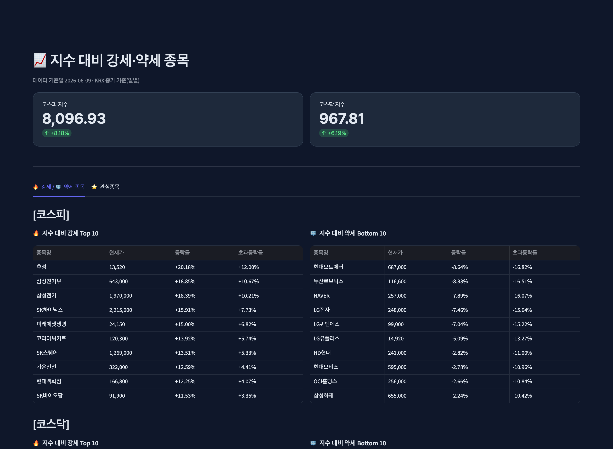

# 지수 대비 강세·약세 종목 대시보드 (v2)

코스피·코스닥 종목을 지수와 비교해 **시장보다 강한/약한 종목**을 보여주는 공개 웹 서비스.
로그인하면 관심종목을 저장하고 개인화된 알림을 받을 수 있도록 단계적으로 확장합니다.

**🔗 라이브 데모 → https://stock-dashboard-rp4n.onrender.com**
<sub>무료 호스팅(Render)이라 한동안 미사용 시 첫 접속에 ~50초 로딩될 수 있어요.</sub>

> v1([naver-stock-dashboard](../portfolio/naver-stock-dashboard))과 별개 프로젝트입니다.
> v1은 네이버 크롤링·로컬용, **v2는 KRX 공식 데이터·로그인·개인화·무료 배포형**입니다.

## 📸 미리보기


## 주요 기능
- 코스피·코스닥 시총 상위 종목의 **지수 대비 강세/약세** (초과등락률 Top/Bottom 10)
- **Google 로그인** + 사용자별 **관심종목** 저장 (기기 넘어 유지)
- 관심종목 **장중 지연시세**(약 15~20분) + **지수 대비 손절 경고**
- 종목·**ETF** 검색, 한국식 색상(상승 빨강 / 하락 파랑), 계산식 툴팁

## 진행 단계
- ✅ Phase 1: KRX 일별 데이터 + 강세/약세 대시보드 (다크 테마)
- ✅ Phase 2: Google 로그인 (Streamlit OIDC)
- ✅ Phase 3: 관심종목 개인화 (Supabase) + 장중 지연시세 (yfinance)
- ✅ Phase 4: 무료 배포 (**Render**) — https://stock-dashboard-rp4n.onrender.com

## 기술
- 데이터: **FinanceDataReader**(KRX 일별), **yfinance**(관심종목 장중 지연시세)
  - ※ 당초 pykrx였으나 최신 pykrx가 KRX 회원 로그인을 요구 → FDR로 전환(동일 KRX 공식 데이터)
- 로그인: **Streamlit 내장 OIDC**(Google) · 저장: **Supabase**(Postgres)
- 화면: **Streamlit** + 커스텀 다크 테마(Pretendard, 인디고) · 분석: pandas

## 실행
```bash
python3 -m venv venv
source venv/bin/activate
pip install -r requirements.txt
streamlit run app.py
```

## ⚠️ 면책
KRX 일별 종가 기준 데이터를 사용하는 **투자 참고용** 서비스이며, 투자 권유가 아닙니다.
모든 투자 판단과 책임은 투자자 본인에게 있습니다.
